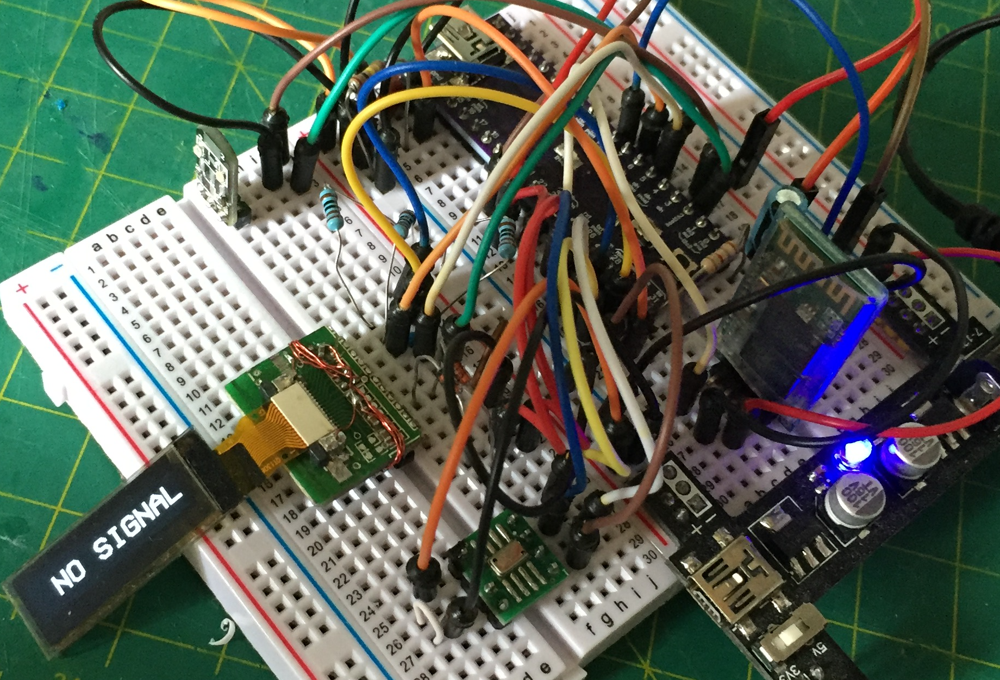
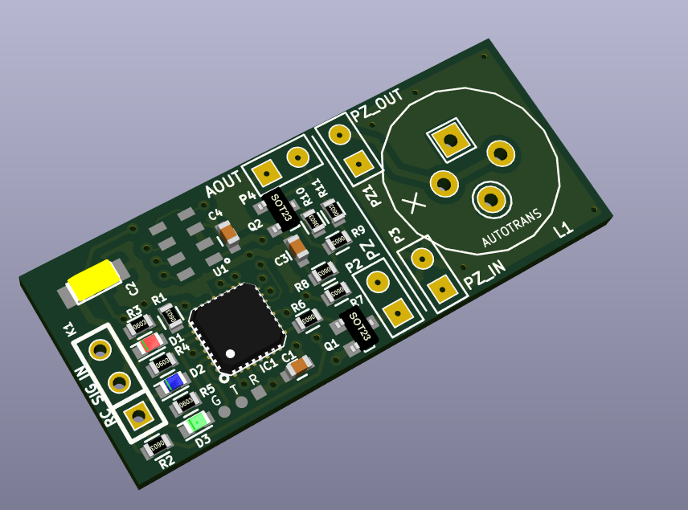
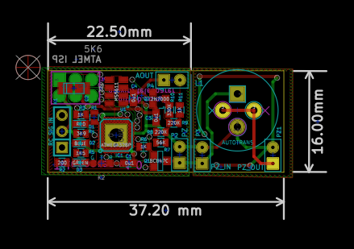

# TeleSoarer
## A remote control, Lost Model Alarm &amp; Variometer, for Slope Soarers / Sailplanes.

#### UPDATED: 2016-12-22

This here is my existing [lost model alarm](https://github.com/gruvin/lostmodel), upgraded to include high resolution (10cm) analog vario output, for use with Fr-Sky telemetry and Taranis radio. 

It gets used for RC model aircraft, "slope soaring". That is, flying about fighting gravity in breezy updrafts, without any intrinsic means of propulsion. So much fun! Sometimes, we goof up or get tossed asunder by viscious rotor (crazy wind!) and cannot find our model. That's where having an audible beacon comes in real handy. Without it, one can be literally one meter away from the aircraft, hiding in long grass just, "exactly where we saw it go in, right?!" ... and simply not be able to see the thing. So, now you know.

The vario — altitude change detector/signal — is in this case, really just for fun. I imagine it to be of _far_ more prctical use in a _thermalling_ a sailplane. But I'm doing it for the slope, anyway.

### Firmware — STM32 MCU
TeleSoarer gets an upgrade from 8bit ATmega88P MCU to a 32bit ARM based, STM32F103CBT. I first discovered this excellent little MCU on a LeafLabs Maple-mini. But that's a whole other story.

Whilst there are a few great efforts to get Arduino style programming of 32bit chips working, I found them all to be a bit too flakey at the moment. So for this project, I used ST's new(ish) `STM32CubeMX` software, which makes short work of writing statrt-up C code for setting up a STM32 with my chosen periperhals and conifguraion. It's all done in pure C language, not C++. Whatever. I found the whole experience simply excellent for quick-out-of-thje-gate STM32 development. Well done ST!

### It's LOUD
The alarm itself is LOUD -- becasue that was the original purpose behind making my own. The MCU outputs a ~2.8KHz square wave at around 15% duty cycle. This is fed to an autotransformer, before arriving at a mechancial cavity resonated quartz wafer (piezo) thingy. All this produces a headsplittingly LOUD tone — indoors at least. Why? Well in practice, models get lost in long grass, on windy, noisy slopes. The pultry beepers available off the shelf are all but useless in these conditioins.

### OLED Display
This new version also includes a 0.91" OLED display, just for kicks really. It gives the whole thing a more friendly user interface for changing settings, if nothing else. 

### Prototype
The complete system has been tested on a breadboard ...

Amazing how big a prototype circuit can be, before getting onto its final PCB.

### PCB
As of this writing, the PCB has been designed, but not yet ordered. Here's a KiCAD rendering of the PCB ... because they're just so darn cute ...

The pizeo section can be chopped off and remote mounted. An OLED display goes on the back.

### The Why
The point of this project was to obtain a nice small footprint, while doing away with all the clunky wires needed for off-the-shelf Fr-Sky telemetry modules (for example). This thing is tiny and will be a welcomed space saver.

I have no idea if anyone else will ever be interested. Drop me a line if that's you. I'd love to know! ;-)

