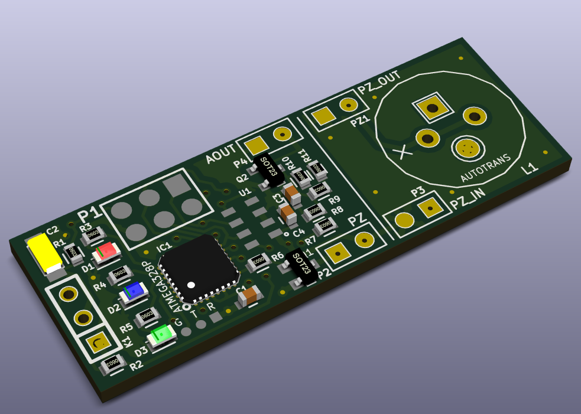

# TeleSoarer
## A Lost Model Alarm &amp; Variometer for RC Slope Soarer / Sailplanes

### It's been a liong day. Not gonna type much here right now. Please contact me via GitHub, if you stumble on this and want more info. Thanks.

For now, let's just say that this is a lost model alarm, per the title above and provides an analogue output for Fr-Sky A1/2 telemtry and OpenTX's (Fr-Sky Taranis) Vario support. 

Here's a KiCAD PCB rendering ... because they're just so cute ...

The board is about 44.2 x 16mm -- though the pizeo section can be chopped off and remote mounted, to give a board just 26x16mm.

In fact, the entire point of this little project was to get a nice small footprint, without all the crazy wires needed for off-the-shelf Fr-Sky telemetry modules, for example. This thing is tiny. 

I already had the lost model alarm portion from my [lostmodel project](https://github.com/gruvin/lostmodel), here on GitHub. 

So, I took that, upgraded the ATmega88P an ATmega328P to get more Flash and changed the firmware from GCC/Makefile to Arduino IDE, just to make it a little easier for others, really. One does still need to use an Atmel programmer however, since I didn't include the extra few components to allow the Arduino IDE uploader thingy to work. Space savings, you know! ;-)

