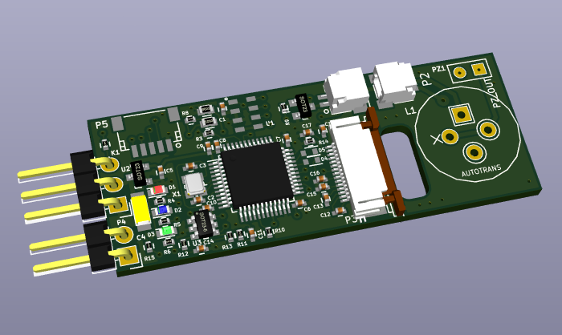
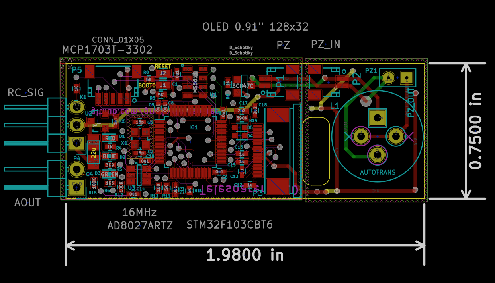

# TeleSoarer
## A Lost Model Alarm &amp; Variometer for RC Slope Soarer / Sailplanes

This here is a lost model alarm, recently upgraded to include analogue vario output, for use with Fr-Sky telemetry and Taranis radio. I use it for slope soaring. The vario in this case is really just for fun. I imagine it to be more useful in a thermalling a sailplane ... and just as fun.

I already had the lost model alarm portion from my [lostmodel project](https://github.com/gruvin/lostmodel), here on GitHub. 
So, I took that, upgraded the ATmega88P to a STM32F103, using ST's new STM32CubeMX software to make short work of starting new projects (without going the Arduino route, that is!) Love that thing.

The alarm itself is more than first meets the eye. The MCU outputs a 2.8KHz square wave at around 15% duty cycle. This is fed to an autotransformer, before arriving at a mechancially resonated (cavity) quartz wafer piezo thingy, to produce a headsplittingly, _very_ LOUD tone -- indoors at least. Very useful for being heard in the wind of the slopes, from hiding places in the long grass! (The frequency and duty cycle were found experiementally, for maximum audio output.)

This new version includes a 0.91" OLED display. It has all been tested on a breadboard. As of this writing, the PCB has not yet been produced. 

Here's a KiCAD PCB rendering of the current design ... because they're just so damned cute ...

The pizeo section can be chopped off and remote mounted. An OLED display goes on the back.

The point of this project was to obtain a nice small footprint, while doing away with all the clunky wires needed for off-the-shelf Fr-Sky telemetry modules (for example). This thing is tiny and will be a welcomed space saver.
